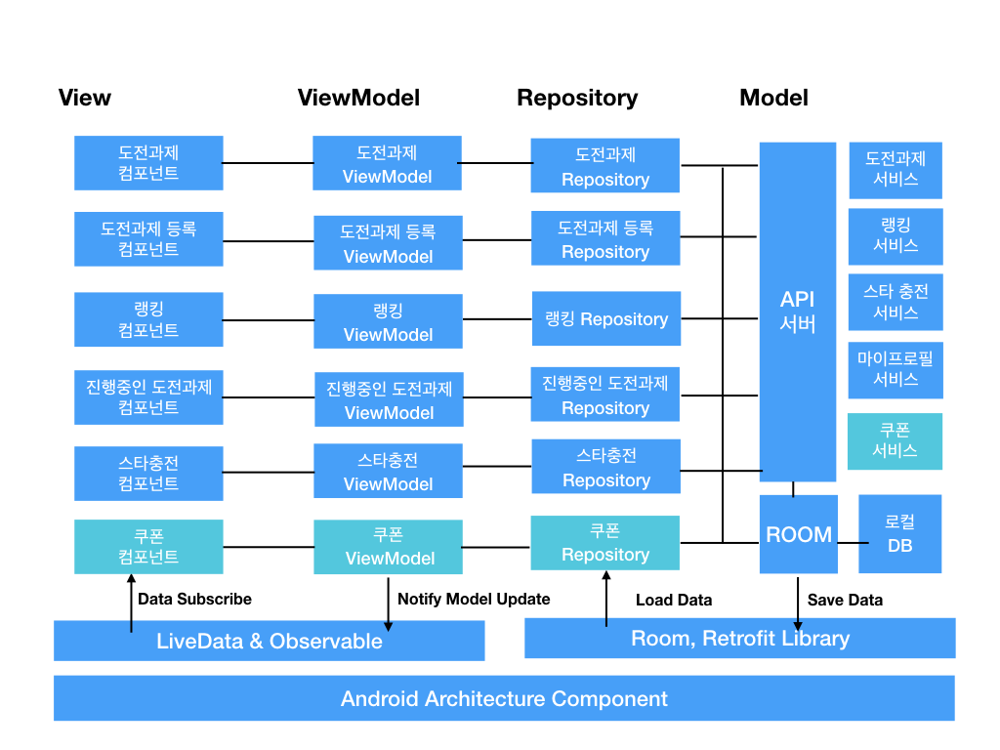

# FLXR

## 소개

서로 자랑하고 존중하면서 사용자들에게 자랑 할 수 있는 판을 깔아주는 SNS 서비스 입니다.

### 설치 방법

아래의 주소를 clone 한 다음에  **Android Studio** 에 다운받은 import 해주면 됩니다. 

```bash
git clone git@github.com/tlqaksqhr/FlxrExample.git
```

그런 뒤 app.gradle, build.gradle을 다시 새로고침 해주면 됩니다.

### Configuration

### Generating signed APK

From Android Studio:

1. ***Build*** 메뉴를 선택합니다
2. ***Generate Signed APK...*** 항목을 선택합니다.
3. keystore 과 관련된 항목을 입력합니다.

### 사용 기술 및 라이브러리

- 프론트 엔드
  - Picasso(Image Loading Library) 2.71828
  - Jsoup(json parsing library) 1.11.3
  - laser-native-editor(html WYSWIG editor library) 3.0.3
  - Androidx:core:core-ktx:1.0.2
  - Androidx.lifecycle:lifecycle-viewmodel-ktx:2.1.0
  - com.synnapps:carouselview:0.1.5
  - Android Lifecycle 1.1.0
    - LiveData
    - Android ViewModel
  - Airbnb Epoxy:3.8.0
    - com.airbnb.android:epoxy-databinding:3.8.0
    - com.airbnb.android:epoxy-processor:3.8.0
  - Android ROOM(ORM Library) 2.2.1
  - Android Material Component 1.1.0-alpha06
  - com.amitshekhar.android:debug-db:1.0.6
  - Okhttp:3.1.4
  - Google Flexbox 1.1.0
  - Google Maps API v2

### 개발 환경

| 환경           | 버전                        |
| -------------- | --------------------------- |
| Development OS | Mac OS X 10.14(High Sierra) |
| Target OS      | Android 9.0(Pie)            |
| Backend        | node.js(express.js)         |
| Database       | Mongo DB, Amazon S3         |
| Test Device    | Galaxy S10, Galaxy Note 4   |
| Cloud Server   | AWS                         |
| Language       | kotlin, node.js             |

## 아키텍처

### 개요

FLXR는 프론트엔드를 안드로이드로 개발하였으며, 백엔드로 node.js와 express.js를 선택하였습니다.

프론트엔드는 MVVM 아키텍처와 레포지토리 패턴을 도입하였으며, 추가적으로 데이터바인딩 기술과 LiveData, ORM(Android ROOM)등의 기술을 도입하였습니다.

### 주요 기능별 상세 내용

#### 1. Frontend

프론트엔드는 MVVM 아키텍처를 도입 하였습니다.  전체 프론트엔드 아키텍처는 아래와 같습니다.



MVVM패턴을 도입함으로써, 비즈니스 로직과 UI와 관련된 로직을 분리하여 서로 관계없는 코드간의 코드 결합도를 줄였습니다.

각 주요 기능(도전과제 생성, 도전과제 목록 보여주기, 스타 충전, 진행중인 도전과제 보여주기)별로 연관된 코드들을 모아 패키징을 함으로써 서로 관련있는 코드간의 결합도는 높였습니다. 뿐만 아니라, 레포지토리 패턴을 도입하여 서로 다른 데이터 소스에서 데이터를 가져오거나 전송하는 경우에도 각 레이어별 의존성이 줄어들어, 코드 구조가 더욱 탄탄합니다.


해당 프로젝트의 주요 컴포넌트들은 아래와 같습니다.


##### 1. 도전과제 목록 컴포넌트

도전과제 목록 컴포넌트는 사용자의 현재 위치를 기반으로, 사용자 위치 주변의 도전과제들을 보여주고 사용자가 원하는 도전과제를 선택하면 도전과제의 위치가 지도에 표시되어 이를 선택하면 도전과제를 수행 할 수 있게 해주는 컴포넌트 입니다. 해당 컴포넌트는 구글 맵 컴포넌트와, List Adapter, Data Binding, LiveData을 이용해 제작 하였습니다. 해당 컴포넌트는 MVVM패턴을 이용해 제작하여 Repository에서 가져온 데이터를 ViewModel 레이어를 통해 뷰에 동적으로 전달하는 구조로 구성되어 있습니다. 이를 통해, 뷰가 변경되거나, 데이터 소스가 변경되는 경우에도 유기적으로 대처 할 수 있게 구성되어있습니다. 또한 ViewHolder패턴을 이용하여 기존 리스트 뷰 보다 향상된 리스트 뷰를 구현하였습니다.


##### 2. 도전과제 등록 컴포넌트

도전과제 등록 컴포넌트는 사용자가 간편하게 원하는 도전과제를 등록할 수 있는 컴포넌트입니다. 해당 컴포넌트는 구글 맵 컴포넌트, 인앱 카메라 모듈, List Adapter, Data Binding, LiveData, Room을 이용해 제작 하였습니다. 해당 컴포넌트는, 도전과제에 대한 개략적인 정보(시작 및 종료 날짜, 제목, 설명 수행 장소)들을 입력하는 부분과, 도전과제 조건을 입력하는 부분으로 구성되어 있습니다. 도전과제 조건은 도전과제 추가 버튼을 통해 동적으로 추가할 수 있으며, 각 도전과제 조건의 왼쪽 이미지를 클릭하여 도전과제 예시 이미지를 추가하고 오른쪽의 텍스트박스를 통해 도전과제 조건에 대한 설명을 작성 할 수 있습니다. 해당 컴포넌트는 MVVM패턴을 이용해 제작하여 Repository에서 가져온 데이터를 ViewModel 레이어를 통해 뷰에 동적으로 전달하는 방식과, 뷰에서 입력받은 정보들을 ViewModel을 거쳐 Repository를 이용해 데이터를 저장소에 저장하는 방식의 구조로 구성되어 있습니다. 이를 통해, 뷰가 변경되거나, 데이터 소스가 변경되는 경우에도 유기적으로 대처 할 수 있게 구성되어있습니다.


##### 3. 진행중인 도전과제 컴포넌트

진행중인 도전과제  컴포넌트는 현재 사용자가 진행중인 도전과제와 찜 해놓은 도전과제를 볼 수 있는 컴포넌트입니다. 해당 컴포넌트는 Epoxy, List Adapter, Data Binding, LiveData, Room, Mediator을 이용해 제작 하였습니다. 해당 컴포넌트는 Expandable RecyclerView처럼 폴더블하게 접이식 리스트 뷰의 형태를 가진 UI를 가지고 있습니다. 이를 구현하기 위해 MVC패턴과 MVVM패턴의 구조를 채택하였습니다. 또한 데이터 바인딩 기법을 동원하여 데이터의 변경(도전과제 완료 여부, 찜 여부, 현재 진행여부, 도전과제 조건 수행 완료 여부)을 동적으로 감지하여 이를 반영, 실제 진행중인 도전과제 목록의 UI를 유기적으로 바꿀 수 있는 구조를 가지고 있습니다. 마지막으로 Repository를 이용해 서로 다른 데이터 소스에서 값을 가져올 때 데이터를 유기적으로 통합하여 실제 UI에 전달하기 위해 MediatorLiveData를 사용하는 방식을 채택하였습니다.


##### 4. 도전과제 자세히보기 컴포넌트

도전과제 자세히 보기 컴포넌트는, 사용자가 선택한 도전과제에 대한 자세한 정보(얻을 수 있는 스타, 도전과제 시작일, 도전과제 종료일, 현재까지 클리어한 사람, 리뷰 목록)를 확인 할 수 있는 컴포넌트 입니다. 해당 컴포넌트는 List Adapter, Data Binding, LiveData을 이용해 제작 하였습니다. 해당 컴포넌트는 MVVM패턴과 옵저버 패턴을 이용해 제작하여 Repository에서 가져온 데이터를 ViewModel 레이어를 통해 뷰에 동적으로 전달하는 구조로 구성되어 있습니다. 이를 통해, 뷰가 변경되거나, 데이터 소스가 변경되는 경우에도 유기적으로 변경된 데이터를 반영하여 UI가 바뀌도록 구성되어있습니다. 또한 ViewHolder패턴을 이용하여 기존 리스트 뷰 보다 향상된 리스트 뷰를 구현하였습니다.


##### 5. 커스텀 UI 컴포넌트 패키지

커스텀 UI컴포넌트는 각 컴포넌트에서 사용되는 커스텀 UI들을 모아놓은 컴포넌트로써, 현재는 스타충전 페이지의 스타 개수를 선택하는 커스텀 라디오 버튼 그룹이 존재합니다. 추후 커스텀 UI 컴포넌트들이 추가되는 경우 해당 컴포넌트 패키지에 추가될 예정입니다.


현재 존재하는 커스텀 UI 컴포넌트(커스텀 라디오 버튼 그룹, 커스텀 라디오 버튼)의 사용방법은 아래와 같습니다.

```kotlin
<com.example.customradiobutton.radiobutton.CustomRadioGroup
android:id="@+id/star_charge_payment_container_custom"
android:layout_width="match_parent"
android:layout_height="wrap_content"
app:layout_constraintEnd_toEndOf="parent"
app:layout_constraintHorizontal_bias="0.0"
app:layout_constraintStart_toStartOf="parent"
app:layout_constraintTop_toBottomOf="@+id/star_charge_payment_toolbar">
  <com.example.customradiobutton.radiobutton.StarCustomRadioButton
  android:id="@+id/star_btn_1"
  android:layout_width="wrap_content"
  android:layout_height="wrap_content"
  android:layout_marginStart="16dp"
  android:layout_marginLeft="16dp"
  android:layout_marginTop="21dp"
  app:layout_constraintStart_toStartOf="parent"
  app:layout_constraintTop_toTopOf="parent"
  app:star_button_bonus="보너스\n10,000"
  app:star_button_count="50"
  app:star_button_price="5,000원\n"/>

	....

</com.example.customradiobutton.radiobutton.CustomRadioGroup>
```

| 속성 이름         | 타입   | 설명                                         |
| ----------------- | ------ | -------------------------------------------- |
| star_button_bonus | String | 스타 충전시 보너스로 받는 스타 개수를 나타냄 |
| star_button_count | String | 스타 충전시 충전되는 스타 개수를 나타냄      |
| star_button_price | String | 스타 충전시 발생하는 비용을 나타냄           |

##### 

##### 6. 데이터 엔티티(QuestEntities.kt) 레이어

각 데이터 엔티티 클래스의 구조는 아래 표와 같습니다.

도전과제(Quest) 클래스

| 멤버 변수 이름   | 타입    | 설명                                                         |
| ---------------- | ------- | ------------------------------------------------------------ |
| id               | Int     | 해당 도전과제의 Primary Key를 나타내는 변수입니다. 해당 변수는 자동으로 지정됩니다. |
| title            | String  | 해당도전과제 제목울 나타내는 변수입니다                      |
| desc             | String  | 해당 도전과제에 대한 설명을 나타내는 변수입니다              |
| isCompleted      | Boolean | 해당 도전과제를 완수했는지에 대한 여부를 나타내는 변수입니다 |
| challengingCount | Int     | 해당 도전과제를 도전한 사람들의 인원수를 나타내는 변수입니다 |
| totalStar        | Int     | 해당 도전과제가 제공하는 최대 스타숫자를 나타내는 변수입니다 |
| questStar        | Int     | 해당 도전과제를 달성했을때 사용자가 얻을 수 있는 스타를 나타내는 변수입니다 |
| numOfComplete    | Int     | 해당 도전과제를 완수한 인원수를 나타내는 변수입니다          |
| address          | String  | 해당 도전과제를 수행할 수 있는 주소를 나타내는 변수입니다    |
| latLng           | LatLng  | 해당 도전과제를 수행할 수 있는 좌표(위도, 경도)를 나타내는 변수입니다 |
| startDate        | String  | 해당 도전과제의 시작 날짜를 의미하는 변수입니다              |
| endDate          | String  | 해당 도전과제의 종료 날짜를 의미하는 변수입니다              |
| isFavorite       | Boolean | 해당 도전과제의 찜 여부를 나타내는 변수입니다                |
| isOngoing        | Boolean | 해당 도전과제가 진행중인지를 나타내는 변수입니다.            |


도전과제 달성조건(QuestConstraint) 클래스

| 멤버 변수 이름 | 타입    | 설명                                                         |
| -------------- | ------- | ------------------------------------------------------------ |
| id             | Int     | 해당 도전과제 달성조건의 Primary Key를 나타내는 변수입니다 해당 변수는 자동으로 지정됩니다. |
| content        | String  | 해당 도전과제 달성조건의 설명을 나타내는 변수입니다          |
| isCompleted    | Boolean | 해당 도전과제 달성조건을 완수했는지에 대한 여부를 나타내는 변수입니다 |
| pictureURL     | String  | 해당 도전과제 달성조건을 달성하기 위한 예시 이미지 URL을 저장하는 변수입니다 |
| questID        | Int     | 해당 도전과제 달성조건과 연관된 도전과제(퀘스트)의 아이디를 나타냅니다(외래키) 해당 변수는 절대 널값이 되어서는 안됩니다 |


도전과제 리뷰(Review) 클래스

| 멤버 변수 이름 | 타입    | 설명                                                         |
| -------------- | ------- | ------------------------------------------------------------ |
| id             | Int     | 해당 도전과제 리뷰의 Primary Key를 나타내는 변수입니다 해당 변수는 자동으로 지정됩니다. |
| content        | String  | 해당 도전과제 리뷰의 내용을 나타내는 변수입니다              |
| rating         | Float   | 해당 도전과제 리뷰의 평점을 나타내는 변수입니다. 0.0 ~ 5.0 사이의 값을 가지며, 0.5점씩 증가합니다. |
| isRetry        | Boolean | 해당 도전과제를 다시 도전할 의사가 있는지를 나타내는 변수입니다 |
| questID        | Int     | 해당 도전과제 리뷰와 연관된 도전과제(퀘스트)의 아이디를 나타냅니다(외래키) 해당 변수는 절대 널값이 되어서는 안됩니다 |


인증이미지(QuestAuthImage) 클래스

| 멤버 변수 이름 | 타입   | 설명                                                         |
| -------------- | ------ | ------------------------------------------------------------ |
| Id             | Int    | 해당 도전과제 인증이미지의 Primary Key를 나타내는 변수입니다 해당 변수는 자동으로 지정됩니다. |
| pictureURL     | String | 해당 도전과제 인증이미지의 URL을 저장하는 변수입니다         |
| questID        | Int    | 해당 도전과제 인증이미지와 연관된 도전과제 달성조건의 아이디를 나타냅니다(외래키) 해당 변수는 절대 널값이 되어서는 안됩니다 |


스타 계좌(StarAccount) 클래스

| 멤버 변수 이름 | 타입 | 설명                                                         |
| -------------- | ---- | ------------------------------------------------------------ |
| id             | Int  | 스타 계좌의 Primary Key를 나타내는 변수입니다. 해당 변수는 자동으로 지정됩니다. |
| starAmount     | Int  | 스타 계좌에 들어있는 총 스타수를 나타내는 변수입니다.        |
| userID         | Int  | 스타계좌와 연관된 유저 아이디를 나타내는 변수입니다.         |


QuestViewItem 클래스

| 멤버 변수 이름   | 타입                  | 설명                                                 |
| ---------------- | --------------------- | ---------------------------------------------------- |
| quest            | Quest                 | 도전과제(퀘스트) 객체를 나타내는 변수입니다          |
| questConstraints | List<QuestConstraint> | 도전과제(퀘스트) 달성조건 목록을 나타내는 변수입니다 |
| questReviews     | List<Review>          | 도전과제(퀘스트) 리뷰 목록을 나타내는 변수입니다     |


Container 클래스

| 멤버 변수 이름              | 타입                        | 설명                                                         |
| --------------------------- | --------------------------- | ------------------------------------------------------------ |
| ongoingQuests               | List<OngoingQuest>          | 현재 진행중인 도전과제(퀘스트) 목록을 나타내는 변수입니다    |
| ongoingQuestHeaderExpanded  | OngoingQuestHeaderExpanded  | 도전과제를 클릭했을때 발생하는 이벤트를 저장하는 변수입니다  |
| favoriteQuests              | List<FavoriteQuest>         | 현재 찜을 해놓은 도전과제(퀘스트) 목록을 나타내는 변수입니다 |
| favoriteQuestHeaderExpanded | FavoriteQuestHeaderExpanded | 찜을 해놓은 도전과제를 클릭했을때 발생하는 이벤트를 저장하는 변수입니다 |


OngoingQuestHeader 클래스

| 멤버 변수 이름 | 타입    | 설명                                                         |
| -------------- | ------- | ------------------------------------------------------------ |
| id             | Int     | 진행중인 도전과제(퀘스트)목록의 아이디를 나타내는 변수입니다. 값이 중복되지 않습니다. |
| isExpanded     | Boolean | 진행중인 도전과제(퀘스트)목록이 펼쳐졌는지에 대한 여부를 나타내는 변수입니다 |
| title          | String  | 진행중인 도전과제(퀘스트) 제목을 나타내는 변수입니다         |
| isCompleted    | Boolean | 진행중인 도전과제(퀘스트)의 완수여부를 나타내는 변수입니다   |
| numOfComplete  | Int     | 진행중인 도전과제(퀘스트)를 완수한 사람들의 숫자를 나타내는 변수입니다. |


OngoingQuest 클래스

| 멤버 변수 이름        | 타입                  | 설명                                                         |
| --------------------- | --------------------- | ------------------------------------------------------------ |
| ongoingQuestHeader    | OngoingQuestHeader    | 진행중인 도전과제(퀘스트)에 대한 정보를 나타내는 변수입니다. |
| questConstraints      | List<QuestConstraint> | 진행중인 도전과제 인증 조건 목록들을 나타내는 변수입니다.    |
| ongoingQuestFooter    | OngoingQuestFooter    | 더미데이터 클래스                                            |
| ongoingQuestAuthClick | OngoingQuestAuthClick | 도전과제 인증 버튼을 클릭 했을시 발생하는 이벤트를 나타내는 변수입니다. |


FavoriteQuestHeader 클래스

| 멤버 변수 이름 | 타입    | 설명                                                         |
| -------------- | ------- | ------------------------------------------------------------ |
| id             | Int     | 찜해놓은 도전과제(퀘스트)목록의 아이디를 나타내는 변수입니다. 값이 중복되지 않습니다. |
| isExpanded     | Boolean | 찜해놓은 도전과제(퀘스트)목록이 펼쳐졌는지에 대한 여부를 나타내는 변수입니다 |
| title          | String  | 찜해놓은 도전과제(퀘스트) 제목을 나타내는 변수입니다         |
| desc           | String  | 찜해놓은 도전과제(퀘스트) 의 내용을 나타내는 변수입니다      |
| isCompleted    | Boolean | 찜해놓은 도전과제(퀘스트)의 완수여부를 나타내는 변수입니다   |
| numOfComplete  | Int     | 찜해놓은 도전과제(퀘스트)를 완수한 사람들의 숫자를 나타내는 변수입니다. |


FavoriteQuest 클래스

| 멤버 변수 이름     | 타입                  | 설명                                                         |
| ------------------ | --------------------- | ------------------------------------------------------------ |
| ongoingQuestHeader | OngoingQuestHeader    | 찜해놓은 도전과제(퀘스트)에 대한 정보를 나타내는 변수입니다. |
| questConstraints   | List<QuestConstraint> | 찜해놓은 도전과제 인증 조건 목록들을 나타내는 변수입니다.    |
| ongoingQuestFooter | OngoingQuestFooter    | 더미데이터 클래스                                            |


ImageAuthData 클래스

| 멤버 변수 이름 | 타입   | 설명                                                 |
| -------------- | ------ | ---------------------------------------------------- |
| filename       | String | 인증하려는 이미지 파일의 이름을 나타내는 변수입니다. |


ImageAuthResult 클래스

| 멤버 변수 이름 | 타입   | 설명                                                         |
| -------------- | ------ | ------------------------------------------------------------ |
| filename       | String | 인증한 결과를 나타내는 이미지 파일 이름을 나타내는 변수 입니다. |
| predicts       | String | 인증 성공/실패 여부를 나타내는 변수입니다. 성공인 경우 True, 실패인 경우 False로 표시됩니다. |


##### 7. 데이터 레포지토리(QuestRepositories) 레이어

데이터 레포지토리 컴포넌트는, 실제 어플리케이션에서 사용하는 데이터들을 외부 저장소에서 가져오는 기능들을 추상화 시켜놓은 부분입니다. 해당 프로젝트에서는 데이터베이스나 REST서버 등과 같은 다양한 데이터 소스에서 데이터를 가져오고 저장하고 변경하기 때문에 이를 각자 다른 함수들을 통해 접근하는 경우 비슷한 코드의 중복으로 인해 결함율이 높아지게 됩니다. 따라서 일관된 데이터 I/O 인터페이스 레이어를 통해 서로 다른 책임을 가진 코드들의 결합도를 줄이는 방식으로 결함율을 낮추기위해 해당 구조를 선택하게 되었습니다. 이를 통해 만약 화면이 변경되거나 데이터 소스가 변경되어도 유기적으로 대처할 수 있게 구성되어있습니다. 또한, 데이터 I/O 작업은 전부 비동기로 수행됩니다. 이를 통해 블로킹으로 인해 앱의 응답성이 지연되는 경우가 현저하게 줄어들게 됩니다.


각 데이터 레포지토리의 구성은 아래와 같습니다.


첫번째로 실제 데이터를 주고받는 함수들이 들어있는 DAO목록들을 정리하면 아래와 같습니다.

| DAO 이름           | DAO 타입           | 설명                                             |
| ------------------ | ------------------ | ------------------------------------------------ |
| questDao           | QuestDao           | 퀘스트 데이터를 주고받는 기능을 하는 클래스      |
| questConstraintDao | QuestConstraintDao | 퀘스트 조건 데이터를 주고받는 기능을 하는 클래스 |
| reviewDao          | ReviewDao          | 리뷰 데이터를 주고받는 기능을 하는 클래스        |
| questAuthImageDao  | QuestAuthImageDao  | 퀘스트 인증 데이터를 주고받는 기능을 하는 클래스 |
| starAccountDao     | StarAccountDao     | 스타 관련 데이터를 주고받는 기능을 하는 클래스   |


마지막으로 Repository 함수들을 정리하면 아래와 같습니다.

| 함수 이름              | 인자           | 리턴 타입                       | 설명                                                   |
| ---------------------- | -------------- | :------------------------------ | ------------------------------------------------------ |
| getQuests              | 없음           | LiveData<List<Quest>>           | 모든 도전과제 목록을 가져오는 함수                     |
| getQuest               | Id(Int)        | LiveData<Quest>                 | 해당 도전과제 ID에 해당하는 도전과제를 가져오는 함수   |
| getQuestViewItem       | id(Int)        | LiveData<QuestViewItem>         | 해당 도전과제에 해당하는 QuestViewItem을 가져오는 함수 |
| getRecentQuestID       | 없음           | Int                             | 가장 최근에 추가한 도전과제 ID를 가져오는 함수         |
| addQuestViewItem       | QuestViewItem  | 없음                            | QuestViewItem을 추가하는 함수                          |
| getQuestReviews        | Review         | LiveData<Review>                | 해당 도전과제의 Review 데이터들을 전부 가져오는 함수   |
| getQuestAuthImages     | 없음           | LiveData<List<QuestAuthImage>>  | 모든 도전과제 인증 데이터를 가져오는 함수              |
| addQuestAuthImages     | QuestAuthImage | 없음                            | 도전과제 인증 데이터들을 추가하는 함수                 |
| addReview              | Review         | 없음                            | 리뷰 데이터를 추가하는 함수                            |
| getStarAccount         | id(Int)        | LiveData<StarAccount>           | 특정 사용자의 스타 계좌 정보를 가져오는 함수           |
| updateStarAccount      | StarAccount    | 없음                            | 스타 계좌 정보를 업데이트 하는 함수                    |
| updateQuest            | Quest          | 없음                            | 도전과제 정보를 업데이트 하는 함수                     |
| getAllQuestConstraints | 없음           | LiveData<List<QuestConstraint>> | 모든 도전과제                                          |


##### 8. 랭킹 컴포넌트

랭킹 컴포넌트는, 각 지역별로 도전과제를 가장 많이 깬 사람을 나타내는 부분과 각 지역별 랭킹을 보여주는 부분 2가지로 나누어져 있습니다. 지역별로 도전과제를 가장 많이 깬 사람을 나타내는 부분은 지도 형태로 표시되어 있으며, 각 지도의 1등을 나타내는 이미지를 클릭하는 경우 해당 지역의 랭킹목록을 볼 수 있게 구성되어 있습니다. 해당 컴포넌트는 List Adapter, Material Component 등을 이용해 제작 하였습니다. 


##### 9. 마이 프로필 컴포넌트

마이 프로필 컴포넌트는 개인정보나, 스타충전, 어플리케이션 설정, 추후 추가될 상점 기능 등을 이용할 수 있는 컴포넌트 입니다. 해당 페이지를 거쳐야만 스타 충전 페이지로 이동할 수 있습니다. 해당 컴포넌트는 Data Binding, LiveData을 이용해 제작 하였습니다. 해당 컴포넌트는 MVVM패턴을 이용해 제작하여 Repository에서 가져온 데이터를 ViewModel 레이어를 통해 뷰에 동적으로 전달하는 구조로 구성되어 있습니다. 이를 통해, 뷰(스타 충전금액을 보여주는 부분)가 변경되거나, 데이터 소스가 변경되는 경우에도 유기적으로 대처 할 수 있게 구성되어있습니다. 


##### 10. 스타충전 컴포넌트

스타충전 컴포넌트는 스타를 충전하는 부분과 스타충전 완료 확인 페이지 이 2가지로 구성되어 있습니다. 스타를 충전하는 부분에서는 커스텀 라디오 버튼을 통해 충전금액을 선택 할 수 있습니다. 충전이 완료되는 경우 선택한 금액에 맞춰 스타가 충전됩니다.


## Team Member 

### 1. 심만섭

- 프론트엔드(안드로이드 앱) 담당
  - 도전과제 등록 기능
  - 도전과제 목록 보기 기능
  - 도전과제 자세히 보기 기능
  - 도전과제 인증 기능
  - 도전과제 리뷰 기능
  - 랭킹 기능
  - 마이페이지 기능
  - 스타 충전 기능

### 2. 안정근

- 백엔드 담당
  - 서버 프로그래밍
  - 데이터베이스 설계
  - ER Diagram 설계
  - 머신러닝 담당

### 3. 김진영

- PM 담당
  - 개발인원 일정 관리
  - 스토리, 업적, 랭킹 요구사항 도출 및 검토
  - 스토리, 업적, 랭킹 UI/UX 검수
  - 추가 기능사항 조율
